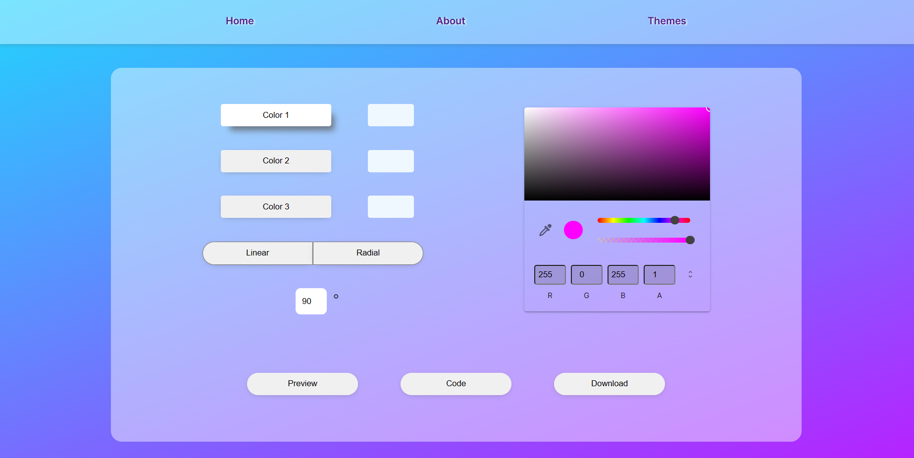
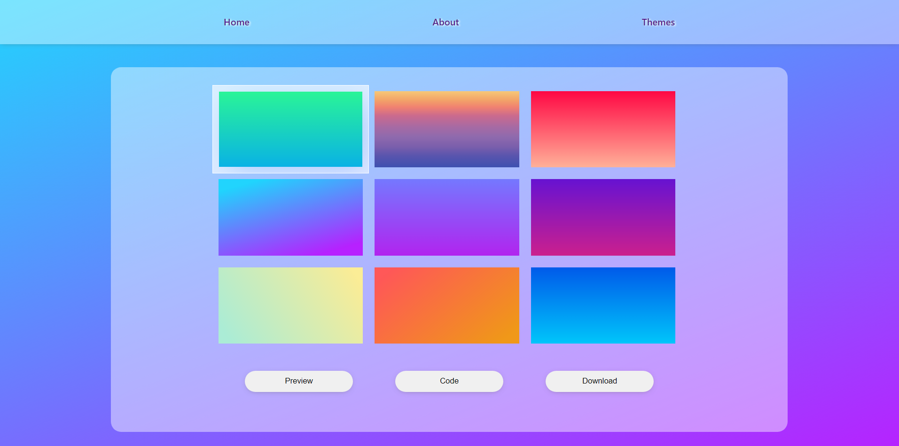

# Vue Gradients

## Table of Contents
* [Description](#description)
* [Usage](#usage)
* [Questions](#questions)

## Description
Vue Gradients is an application that allows users to either choose from a selection of CSS gradients or generate their own linear or radial gradients. Once chosen, gradients can be copied to clipboard or downloaded as a PNG. 

## Usage
From the home page, up to 3 colors can be chosen using the color picking widget and then clicking on the color buttons to lock it in. Once the gradient options have been chosen, the output can be viewed fullscreen by pressing the 'Preview' button (cancelled by clicking anywhere on the screen). The gradient can also be copied to clipboard with the 'Code' button and also downloaded.

## Questions
Follow me on [Github](https://github.com/Kayvonk).

To contact me, send an email to kayvonk@gmail.com with your name and inquiry.

Deployed Application: https://vuegradients.netlify.app/